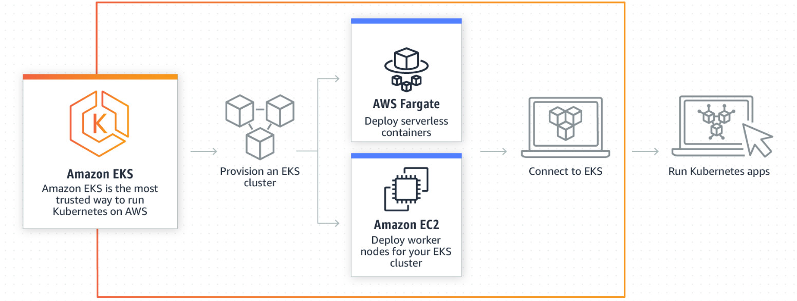
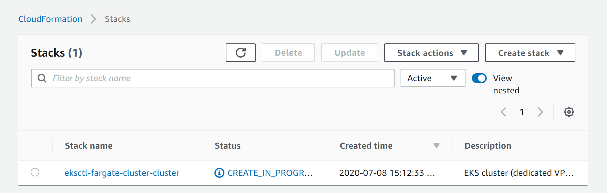
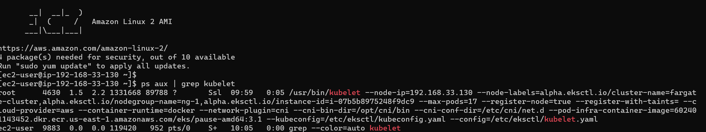
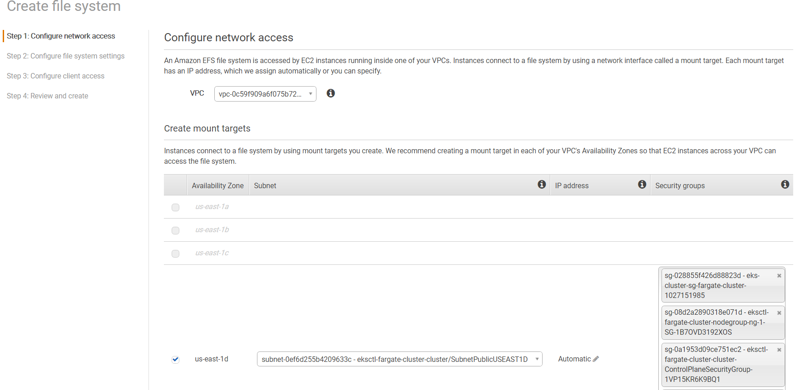
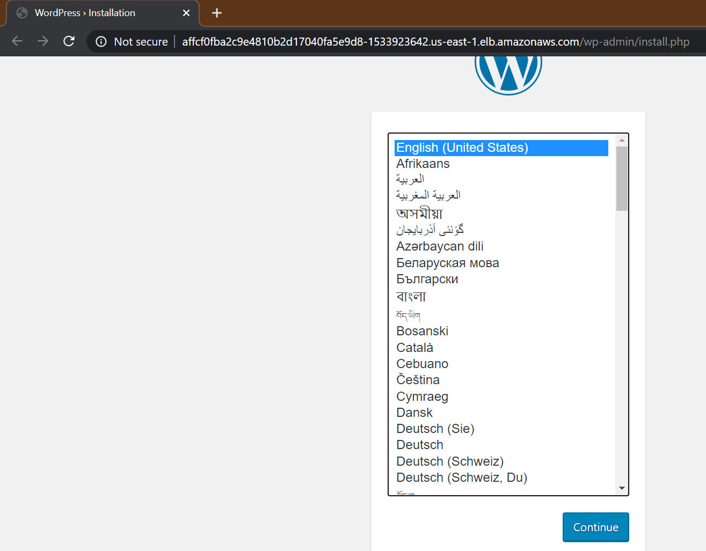
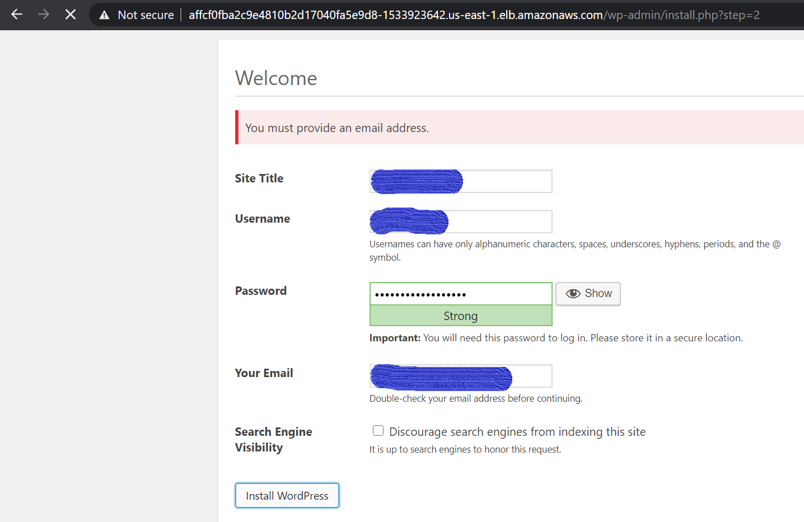
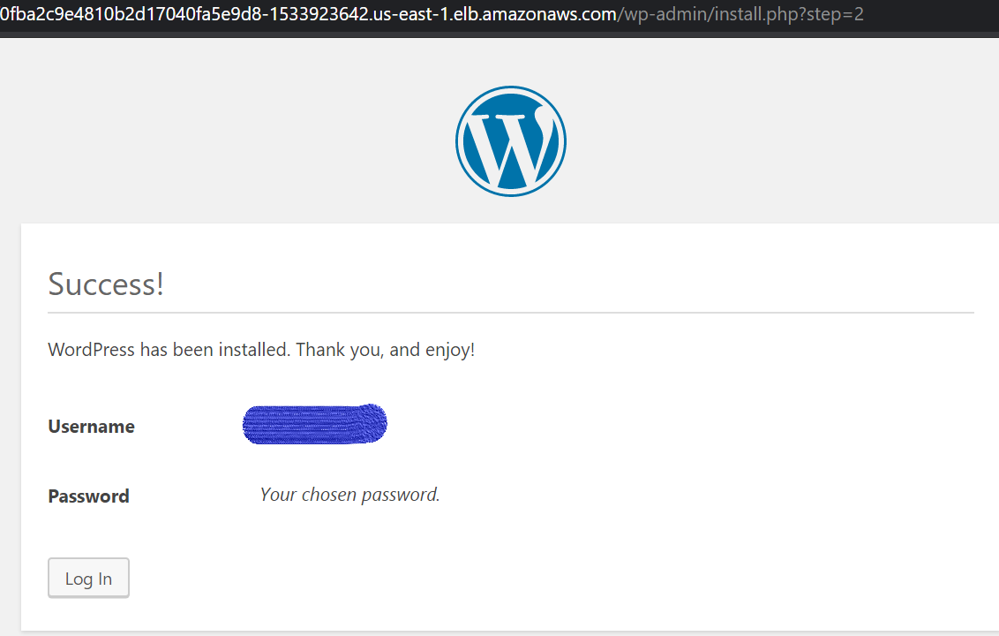
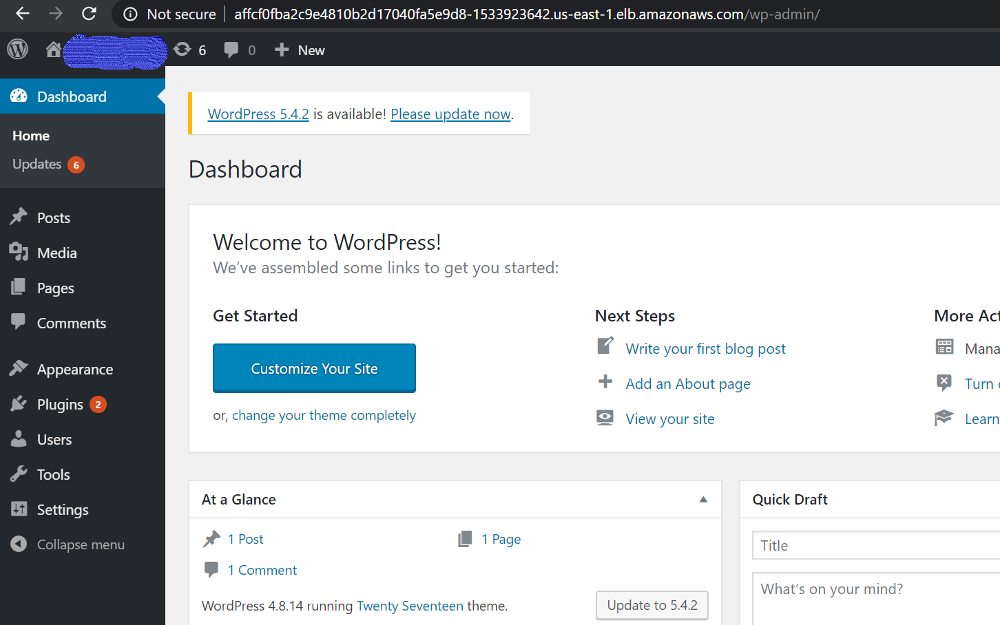

# AWS EKS(fully managed K8s master) cluster with AWS EFS dynamic provisioning and AWS Fargate for serverless deploying Pods.


## Amazon Elastic Kubernetes Service 
(Amazon EKS) is a fully managed Kubernetes service. 
EKS runs upstream Kubernetes and is certified Kubernetes 
conformant so you can leverage all benefits of open source 
tooling from the community. You can also easily migrate any 
standard Kubernetes application to EKS without needing to refactor 
your code. Current EKS supports K8s v 1.14, 1.15, 1.16(default).

## Prerequisite:- 
A station is required where aws cli v2, eksctl, and kubectl commands 
preconfigured. An IAM user with enough policies so that it can create 
an AWS EKS cluster and AWS EFS file system in the same VPC.

Also, choose the region for deploying eks cluster wisely and be aware of 
aws billing for these services.

###### [EKS pricing](https://aws.amazon.com/eks/pricing/)
###### [availability on some AWS Regions ](https://aws.amazon.com/about-aws/whats-new/2020/04/eks-adds-fargate-support-in-frankfurt-oregon-singapore-and-sydney-aws-regions/)


eksctl is a simple CLI tool for creating clusters on EKS - 
Amazon's new managed Kubernetes service for EC2. It is written 
in Go, uses CloudFormation, was created by Weaveworks and it
 welcomes contributions from the community. Create a basic 
cluster in minutes with just one command: 
```
# eksctl create cluster
```
## So, here we start creating our EKS cluster using eksctl command.
Customize your cluster by using a config file. Just run

```
[root@server ~]# eksctl get cluster
No clusters found
[root@server ~]# eksctl create cluster -f  fargatecluster.yaml
```
to apply a fargatecluster.yaml file:

```
---
apiVersion: eksctl.io/v1alpha5
kind: ClusterConfig
metadata:
  name: fargate-cluster
  region: us-east-1
nodeGroups:
  - name: ng-1
    minSize: 2
    maxSize: 3
    desiredCapacity: 2
    instancesDistribution:
      maxPrice: 0.5
      instanceTypes: [ "t2.medium" ]
    ssh:
      publicKeyName: yourkey
fargateProfiles:
  - name: fp-default
    selectors:
      # All workloads in the "default" Kubernetes namespace will be
      # scheduled onto Fargate:
      - namespace: default
      # All workloads in the "kube-system" Kubernetes namespace will be
      # scheduled onto Fargate:
      - namespace: kube-system
  - name: fp-dev
    selectors:
      # All workloads in the "dev" Kubernetes namespace matching the following
      # label selectors will be scheduled onto Fargate:
      - namespace: dev
        labels:
          env: dev
          checks: passed
```
###### It takes time according to our capacity planning since, behind eksctl, it uses cloud formation stacks.




```
[root@server ~]# aws eks list-clusters
{
    "clusters": [
        "fargate-cluster"
    ]
}
root@server ~]# eksctl get cluster
NAME            REGION
fargate-cluster us-east-1
[root@server ~]# aws eks update-kubeconfig --name fargate-cluster
Added new context arn:aws:eks:us-east-1:<ID>:cluster/fargate-cluster to ~/.kube/config
```
###### We can check our worker nodes after completely configured as K8s worker node using a public key for ssh we used in the fargatecluster.yml file.

```
[root@server ~]# ssh -i yourkey -l ec2-user  <workernode-ip>
```



###### Now, we can create our EFS file system in the same region and on the same VPC which our EKS cluster is using currently.



###### After the successful creation of our EFS File System, now we can configure our worker nodes/minions so that they are able to mount the EFS filesystem automatically on EFS dynamic provisioning for the Persistent Volume Claims.

```
[root@server ~]# ssh -i mykey1234.pem  ec2-user@<worker-nodes> "sudo yum install -y amazon-efs-utils"
```
###### Create an EFS dynamic provisioner in the current namespace(default) and our PVs, and PVCs.

```
[root@server ~]# kubectl create -f create-rbac.yaml
clusterrolebinding.rbac.authorization.k8s.io/nfs-provisioner-role-binding created
[root@server ~]# kubectl create -f create-efs-provisioner.yaml
deployment.apps/efs-provisioner created
[root@server ~]# kubectl create -f create-storageclass.yaml
storageclass.storage.k8s.io/aws-efs created
[root@server ~]# kubectl create -f create-wordpress-pvc.yaml
persistentvolumeclaim/efs-wordpress created
[root@server ~]# kubectl create -f create-mysql-pvc.yaml
persistentvolumeclaim/efs-mysql created
[root@server ~]# kubectl get pvc
NAME            STATUS   VOLUME                                     CAPACITY   ACCESS MODES   STORAGECLASS   AGE
efs-mysql       Bound    pvc-8002c07d-1cda-47f4-9cbd-a7bfed00e77e   1Gi        RWX            aws-efs        10m
efs-wordpress   Bound    pvc-aa261ca3-c8d6-4022-8a1c-57e7eede8df4   1Gi        RWX            aws-efs        10m
[root@server ~]# kubectl get pv
NAME                                       CAPACITY   ACCESS MODES   RECLAIM POLICY   STATUS   CLAIM                   STORAGECLASS   REASON   AGE
pvc-8002c07d-1cda-47f4-9cbd-a7bfed00e77e   1Gi        RWX            Delete           Bound    default/efs-mysql       aws-efs                 9m51s
pvc-aa261ca3-c8d6-4022-8a1c-57e7eede8df4   1Gi        RWX            Delete           Bound    default/efs-wordpress   aws-efs                 9m51s
```

###### Now, we can create our resources like services, deployments.

```
[root@server ~]# kubectl create -f secrets.yaml
secret/mysql-pass created
[root@server ~]# kubectl create -f deploy-mysql.yaml
service/wordpress-mysql created
deployment.apps/wordpress-mysql created
[root@server ~]# kubectl create -f deploy-wordpress.yaml
service/wordpress created
deployment.apps/wordpress created
[root@server ~]# kubectl get svc
NAME              TYPE           CLUSTER-IP      EXTERNAL-IP                                                               PORT(S)        AGE
kubernetes        ClusterIP      10.100.0.1      <none>                                                                    443/TCP        90m
wordpress         LoadBalancer   10.100.16.248   affcf0fba2c9e4810b2d17040fa5e9d8-1533923642.us-east-1.elb.amazonaws.com   80:31847/TCP   52s
wordpress-mysql   ClusterIP      None            <none>                                                                    3306/TCP       62s
[root@server ~]# kubectl get pods
NAME                               READY   STATUS    RESTARTS   AGE
efs-provisioner-864ddccb7-2qczt    1/1     Running   0          74s
wordpress-d46cfd788-gcjmk          1/1     Running   0          21s
wordpress-mysql-689fcd5cd4-67mzs   1/1     Running   0          31s
```

###### Finally, we can access our Stateful applications e.g. WordPress using the domain name provided by AWS ELB(classical load balancer) services.







###### [AWS Fargate](https://docs.aws.amazon.com/eks/latest/userguide/fargate.html)

###### [Assign pods to the nodes](https://kubernetes.io/docs/concepts/scheduling-eviction/assign-pod-node/)
